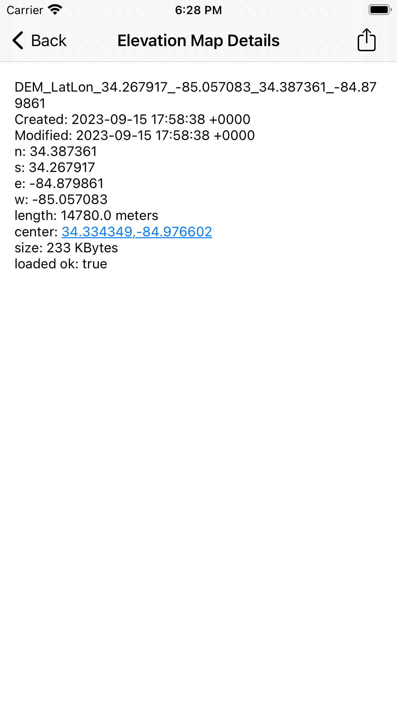

# OpenAthena™ for iOS
OpenAthena for iOS

(This software is currently in alpha.)

An iOS port of the [OpenAthena project](http://OpenAthena.com)

Find it the [App Store](https://apps.apple.com/us/app/openathena/id6448763554)

<a href='https://apps.apple.com/us/app/id6448763554'></a>

OpenAthena™ allows common drones to spot precise geodetic locations.

🖼️👨‍💻 + 🧮⛰️ = 🎯📍

<a href="https://github.com/mkrupczak3/OpenAthena"></a>


# Operation Guide

## A note about GeoTIFF Digital Elevation Models/Maps:

OpenAthena needs GeoTIFF digital elevation models/maps data.  GeoTIFF
files store terrain elevation data for an area on Earth. OpenAthena
performs a ray-cast from a drone camera's position and orientation
towards the terrain, which can be used to precisely locate any point
within a given picture.

OpenAthena for iOS can now download elevation maps directly from <a
href="https://www.opentopography.org">OpenTopography</a> at the touch
of a button.  Downloaded elevation maps are saved in the app's local
storage.  Elevation maps can be imported, exported, or pre-fetched
given a lat,lon.  When processing a drone image, OpenAthena will
automatically search through its cache of elevation maps and select
the correct one for the image being processed.  If an elevation map is
not found, OpenAthena will offer to download one.  Image analysis can
then continue.  Use the pre-fetch option if you will be offline while
flying.

<p align="center">
  
  &nbsp; &nbsp; &nbsp; &nbsp
  
</p>
  
To manage OpenAthena's elevation map cache, select "Manage Elevation
Maps" from the main screen menu.  From there, you can manage or search
your cache for an elevation map based on lat,lon coordinates.

<p align="center">
  
  &nbsp; &nbsp; &nbsp; &nbsp
    
</p>

You can delete elevation maps by swiping right or you can inspect an
elevation map by selecting the cache entry.  Pressing "+" allows you
to add a new elevation map to OpenAthena.

To add a new elevation map to OpenAthena, you have two options.
First, you can import an elevation map you already have (in GeoTIFF
format) from local file.  Second, you input the desired lat,lon
coordinates and size in meters of the bounding box and OpenAthena will
fetch and download an elevation map with those parameters.  This last
feature is handy if you wish to pre-fetch elevation maps before
flying.  (Internet access is needed to download elevation maps.)

## Calibrate your drone's compass sensor 🧭 and take photos :

It is _**strongly suggested**_ that you should [calibrate the drone's
compass sensor for the local
environment](https://phantompilots.com/threads/compass-calibration-a-complete-primer.32829/)
before taking photos to be used with OpenAthena. Consult your drone's
operation manual for this procedure. The image metadata from an
un-calibrated drone can be several degrees off from the correct
heading. This can result in dramatic target-resolution inaccuracies if
the sensor is not calibrated. _**Always**_ verify a target match
location from OpenAthena before use!

## Select an Image 🖼:

This app is compatible with images taken by select models of DJI,
Skydio, Autel, and Parrot aircraft models. The drone's position and
its camera's orientation are automatically extracted from the image
metadata.


After loading a drone image, OpenAthena will search through its cache
for an appropriate elevation map.  If one is not found, OpenAthena
will offer to download one for you.

## Calculate a target 🧮 🎯:

Press the "🧮" button to calculate the target location on the
ground. You can tap the result display box to copy the result text to
your clipboard or open the position in Google Maps by clicking the
blue hyperlink:


## Arbitrary Point Selection

OpenAthena allows users to tap any point in the image to locate it. Tapping on any point in the image will move the marker and calculate the new location.


# Application Settings (optional) ⚙:

OpenAthena for iOS supports multiple output modes for target calculation, including:

* Latitude, Longitude (standard WGS84)
* [Nato Military Grid Reference System](https://en.wikipedia.org/wiki/Military_Grid_Reference_System) (MGRS) 1m, 10m, and 100m
* [CK-42 Система координат](https://en.wikipedia.org/wiki/SK-42_reference_system) Latitude Longitude (an alternative geodetic system commonly used in slavic countries)
* [CK-42 Система координат](https://en.wikipedia.org/wiki/SK-42_reference_system) [Gauss-Krüger](https://desktop.arcgis.com/en/arcmap/latest/map/projections/gauss-kruger.htm) Grid: Northing, Easting (an alternative military grid reference system used by former Warsaw pact countries)
* [Universal Transverse Mercator (UTM)](https://en.wikipedia.org/wiki/Universal_Transverse_Mercator_coordinate_system)

To change the ouptut mode of OpenAthena for iOS, tap the hamburger
menu icon (three lines) at the top-right corner of the main screen and
select "Settings":

Select your desired output mode by pressing its button in the list and
then click the Save button.


# Contributing

## UI language translation
If you speak another language in addition to English, please consider
contributing to the UI translation using the link below. The insights
of a native-speaker are the only way to provide a good user experience
for the program in a given language:

[https://www.transifex.com/thetalimited/openathena-for-ios/](https://www.transifex.com/thetalimited/openathena-for-ios/)


## Code

If you're interested in contributing to this project, feel
free to make a fork. This project will follow the [fork and pull
model](https://reflectoring.io/github-fork-and-pull/) for third-party
contributors

### Cloning this project with submodules
This project requires content from other git repositories to build correctly.

To clone this project properly, with the necessary submodules:
```bash
git clone --recursive git@github.com:Theta-Limited/OpenAthenaIOS.git # can also use https clone url instead
```

If you have already cloned, and wish to acquire the neccesary submodule contents:
```bash
git submodule init
git submodule update
```

If you wish to update the contents of submodules from their source:
```bash
git submodule update --remote
```
