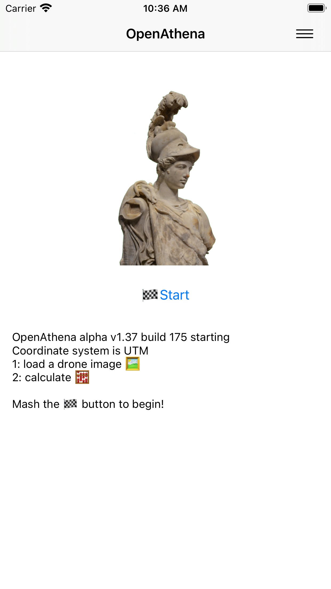

# OpenAthena™ for iOS
OpenAthena for iOS

(This software is currently in alpha.)

An iOS port of the [OpenAthena project](http://OpenAthena.com)

Find it the [App Store](https://apps.apple.com/us/app/openathena/id6448763554)

OpenAthena™ allows common drones to spot precise geodetic locations.

🖼️👨‍💻 + 🧮⛰️ = 🎯📍

Get it in the Apple App Store (coming soon)

# Operation Guide

## Obtain a GeoTIFF Digital Elevation Model:

To use this app, you need a GeoTIFF Digital Elevation Model (DEM)
file. GeoTIFF files store terrain elevation data for an area on
Earth. OpenAthena performs a ray-cast from a drone camera's position
and orientation towards the terrain, which can be used to precisely
locate any point within a given picture.

To obtain a GeoTIFF file for a certain area, use [this
link](https://github.com/mkrupczak3/OpenAthena/blob/main/EIO_fetch_geotiff_example.md).

Unfortunately, the [NGA tiff library for
iOS](https://github.com/ngageoint/tiff-ios) does not support tiff
compression.  Consequently, DEMs should be obtained using Method 1
from the above web link.  Method one makes use of [Open Topography
SRTM elevation
data](https://portal.opentopography.org/raster?opentopoID=OTSRTM.082015.4326.1)

If you try to load or use an elevation model containing TIFF
compression, the application will catch the NSException and not
compute the altitude for the target location.

## Load a GeoTIFF Digital Elevation Model  ⛰:

Load the DEM file (e.g. cobb.tiff) using the "⛰" button. The app will
display the size of the file and its latitude and longitude
boundaries:

(NOTE: during file selection, the thumbnail image preview for any
GeoTIFF ".tiff" file will be blank. This is normal.)

## Calibrate your drone's compass sensor 🧭 and take photos :

It is _**strongly suggested**_ that you should [calibrate the drone's
compass sensor for the local
environment](https://phantompilots.com/threads/compass-calibration-a-complete-primer.32829/)
before taking photos to be used with OpenAthena. Consult your drone's
operation manual for this procedure. The image metadata from an
un-calibrated drone can be several degrees off from the correct
heading. This can result in dramatic target-resolution inaccuracies if
the sensor is not calibrated. _**Always**_ verify a target match
location from OpenAthena before use!

## Select an Image 🖼:

This app is compatible with images taken by select models of DJI,
Skydio, Autel, and Parrot aircraft models. The drone's position and
its camera's orientation are automatically extracted from the image
metadata.

After loading a GeoTIFF DEM, use the "🖼" button to select a drone
image containing the necessary metadata:

## Calculate a target 🧮 🎯:

Press the "🧮" button to calculate the target location on the
ground. You can tap the result display box to copy the result text to
your clipboard or open the position in Google Maps by clicking the
blue hyperlink:

# Application Settings (optional) ⚙:

OpenAthena for iOS supports multiple output modes for target calculation, including:

* Latitude, Longitude (standard WGS84)
* [Nato Military Grid Reference System](https://en.wikipedia.org/wiki/Military_Grid_Reference_System) (MGRS) 1m, 10m, and 100m
* [CK-42 Система координат](https://en.wikipedia.org/wiki/SK-42_reference_system) Latitude Longitude (an alternative geodetic system commonly used in slavic countries)
* [CK-42 Система координат](https://en.wikipedia.org/wiki/SK-42_reference_system) [Gauss-Krüger](https://desktop.arcgis.com/en/arcmap/latest/map/projections/gauss-kruger.htm) Grid: Northing, Easting (an alternative military grid reference system used by former Warsaw pact countries)

To change the ouptut mode of OpenAthena for iOS, tap the kebab menu
icon (three dots) at the top-right corner of the main screen and
select "Settings":

Select your desired output mode by pressing its button in the list and
then click the Save button.

# Contributing

## UI language translation
If you speak another language in addition to English, please consider
contributing to the UI translation using the link below. The insights
of a native-speaker are the only way to provide a good user experience
for the program in a given language:

[https://www.transifex.com/thetalimited/openathena-for-ios/](https://www.transifex.com/thetalimited/openathena-for-ios/)

## Code

If you're interested in contributing to this project, feel
free to make a fork. This project will follow the [fork and pull
model](https://reflectoring.io/github-fork-and-pull/) for third-party
contributors
