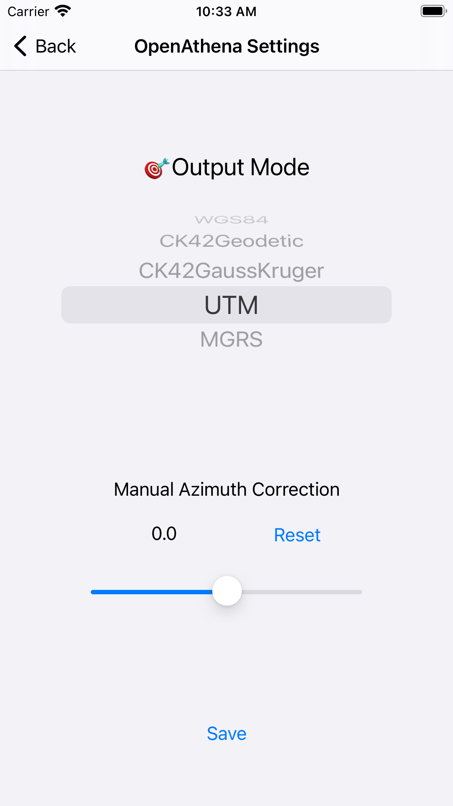

# OpenAthena™ for iOS
OpenAthena for iOS

(This software is currently in beta.)

An iOS port of the [OpenAthena project](http://OpenAthena.com)

Find it the [App Store](https://apps.apple.com/us/app/openathena/id6448763554)

OpenAthena™ allows common drones to spot precise geodetic locations.

🖼️👨‍💻 + 🧮⛰️ = 🎯📍

  

 

**NOTICE: OpenAthena for iOS is no longer open source to the general
public, following a license change from Theta Informatics LLC.  While
no longer open source, it will remain available as a free app download
in the Apple App Store.**

U.S. Government, Military, and other trusted end users can request
source code access by emailing [support@theta.limited](mailto:support@theta.limited).

# Operation Guide

## A note about GeoTIFF Digital Elevation Models/Maps:

OpenAthena for iOS needs GeoTIFF digital elevation models (aka
elevation maps) data to calculate target locations within drone
images.  GeoTIFF files store terrain elevation data for an area on
Earth. OpenAthena performs a ray-cast from a drone camera's position
and orientation towards the terrain, which can be used to precisely
locate any point within a given picture.

OpenAthena for iOS can now download elevation maps for the user from
<a href="https://www.opentopography.org">OpenTopography</a> at the
touch of a button.  Downloaded elevation maps are saved in the app's
local storage.  Elevation maps can be imported, exported, or
pre-fetched for the area surrounding any given lat,lon.  When
processing a drone image, OpenAthena will automatically search through
its cache of elevation maps and select the correct one for the image
being processed.  If an elevation map is not found, OpenAthena will
offer to download one.  Image analysis can then continue.

If you are planning on operating in an offline enviroment, you can use
the pre-fetch functionality to download elevation maps for later
offline use.
  
To manage OpenAthena's elevation map cache, select "Manage Elevation
Maps" from the main screen menu.  From there, you can manage or search
your cache for an elevation map based on lat,lon coordinates.

You can delete elevation maps by swiping right or you can inspect an
elevation map by selecting the cache entry.  Pressing "+" allows you
to add a new elevation map to OpenAthena.

  
  &nbsp; &nbsp; &nbsp; &nbsp
  

To add a new elevation map to OpenAthena, you can either download one
from online or import one from a local file. 

To download an elevation map from online, you input the desired
lat,lon coordinates and length in meters of the bounding box and
OpenAthena will fetch it.  Alternatively, you can load a drone image
and OpenAthena will offer to download an elevation map of the
surrounding area if needed.  (Internet access is needed to download
elevation maps.)

OpenAthena can also import an elevation map in GeoTIFF format from
local storage.

    

## Calibrate your drone's compass sensor 🧭 and take photos :

It is _**strongly suggested**_ that you should [calibrate the drone's
compass sensor for the local
environment](https://phantompilots.com/threads/compass-calibration-a-complete-primer.32829/)
before taking photos to be used with OpenAthena. Consult your drone's
operation manual for this procedure. The image metadata from an
un-calibrated drone can be several degrees off from the correct
heading. This can result in dramatic target-resolution inaccuracies if
the sensor is not calibrated. _**Always**_ verify a target match
location from OpenAthena before use!

## Select an Image 🖼:

This app is compatible with images taken by select models of DJI,
Skydio, Autel, and Parrot aircraft models. The drone's position and
its camera's orientation are automatically extracted from the image
metadata.

After loading a drone image, OpenAthena will search through its cache
for an appropriate elevation map.  If one is not found, OpenAthena
will offer to download one for you.

## Calculate a target 🧮 🎯:

Press the "🧮" button to calculate the target location on the
ground. You can tap the result display box to copy the result text to
your clipboard or open the position in Google Maps by clicking the
blue hyperlink:

## Arbitrary Point Selection

OpenAthena allows users to tap any point in the image to locate it. Tapping on any point in the image will move the marker and calculate the new location.

# Application Settings (optional) ⚙:

OpenAthena for iOS supports multiple output modes for target calculation, including:

* Latitude, Longitude (standard WGS84)
* [Nato Military Grid Reference System](https://en.wikipedia.org/wiki/Military_Grid_Reference_System) (MGRS) 1m, 10m, and 100m
* [CK-42 Система координат](https://en.wikipedia.org/wiki/SK-42_reference_system) Latitude Longitude (an alternative geodetic system commonly used in slavic countries)
* [CK-42 Система координат](https://en.wikipedia.org/wiki/SK-42_reference_system) [Gauss-Krüger](https://desktop.arcgis.com/en/arcmap/latest/map/projections/gauss-kruger.htm) Grid: Northing, Easting (an alternative military grid reference system used by former Warsaw pact countries)
* [Universal Transverse Mercator (UTM)](https://en.wikipedia.org/wiki/Universal_Transverse_Mercator_coordinate_system)

To change the ouptut mode of OpenAthena for iOS, tap the hamburger
menu icon (three lines) at the top-right corner of the main screen and
select "Settings":

Select your desired output mode by pressing its button in the list and
then click the Save button.

If you find your aircraft's compass sensor is still not providing
correct heading information, you can use this slider to manually apply
a configurable offset anywhere in the range of [-15.0,+15.0].  This
offset will be added to your aircraft's camera heading before target
calculation is performed.

Once you find a suitable correction value, you may then use the value
for all other images taken during the same flight.

**NOTE:** This value is _**NOT**_ for setting [magnetic
declination](https://ngdc.noaa.gov/geomag/declination.shtml)!
Magnetic declination is already accounted for by your drone's onboard
digital World Magnetic Model (WMM).  Improper use of this Manual
Offset setting will result in bad target calculation output.

Your selected manual correction value is saved automatically between
launches of the app.  To reset the value, tap the Reset button in the
Settings screen or move the slider back to the middle.
